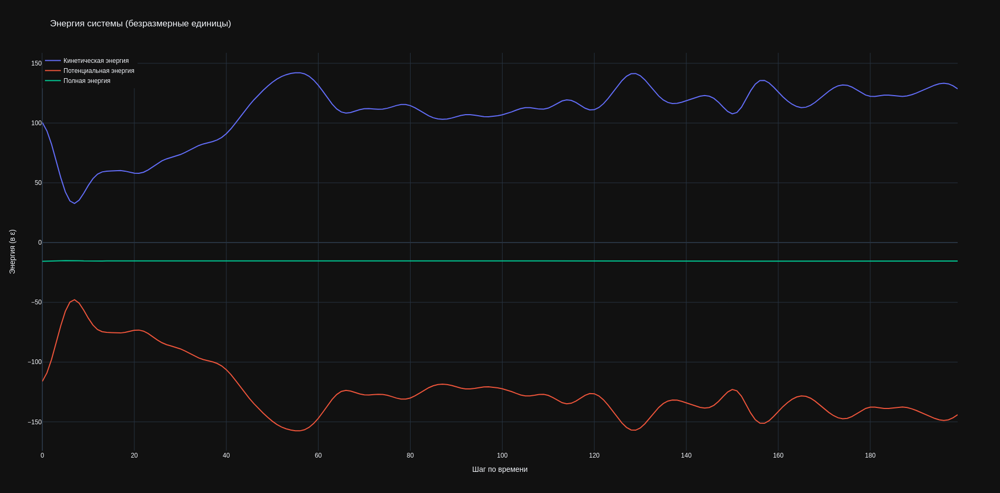
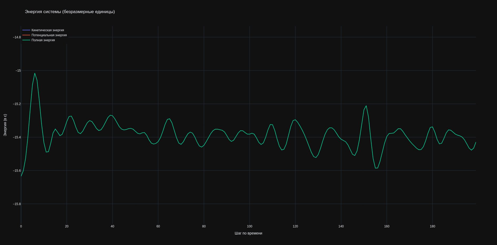

# Компьютерная физика 2025 год, школа 1580

### Графики энергий без термализации

### Введение термализации (первые 20 шагов)

То же самое, но на 2000 шагов.

## [task_1.py](task_1.py): Исследование фаз

## [task_2.py](task_2.py): E(T) при плотности ρ = 0.4

## [task_3.py](task_3.py): Зависимость энергии и давления от плотности при T = 0.45

## Визуализация - [vis.py](vis.py)